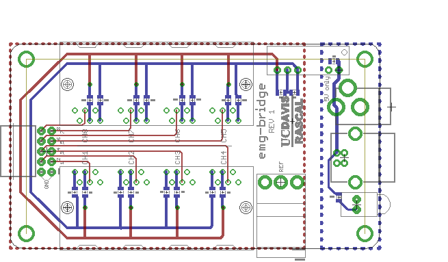

==========
emg-bridge
==========

Description
===========

This board is for provding an interface between multiple Motion Labs Y03
amplifiers and a DAQ. The board provides RJ25 (6p6c modular jack) connectors
for plugging in up to 8 amplifiers. 5V power from either a barrel plug ("wall
wart") or USB-B is converted to +/-5V (isolated from power source, which
powers the amplifiers. The signal output from each amplifier is output through
a flat ribbon cable to the DAQ. A single ground electrode can be plugged in to 
a header pin.

License
=======

The contents of this repository are licensed under the `CC-BY 4.0 license`_.

.. REFERENCES
.. _`CC-BY 4.0 license`: https://creativecommons.org/licenses/by/4.0/
